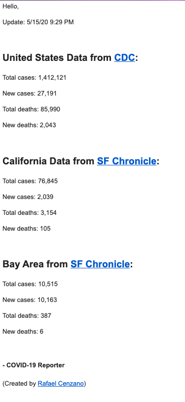

# COVID-19 reporter

Simple project that requests and webscrapes website then sends email when new content is released.

CDC stopped updating the page

#### Requirements

create a secret.py with these variables:

```
import os

senderEmail = 'youremail@gmail.com' # has to be gmail
senderPassword = 'you app password'
recieverEmails = ['contact@domain.com', 'other@domain.com']
jsonFilePath = '/' + os.path.join('Users','jimdoe','Documents','Corona-Virus-Email-Updater','past.json')
```

[Use a virtualenv to create an isolated enviorment](https://virtualenv.pypa.io/en/latest/)

Run the make command to install requirements

```
make
```

or with pip manually

```
pip3 install -r requirements.txt
```

## Running the program

Run description

```
make run
```

or with python manually

```
python3 run.py
```

## Authors

* [**Rafael Cenzano**](https://github.com/RafaelCenzano)

## License

This project's license here: [LICENSE](LICENSE)


This Readme was created with [pystarter](https://github.com/RafaelCenzano/PyStarter)

```
pip3 install pystarter
```

## Example Email:

New Example:

Image:



Text:

```
Hello,

Update: 5/15/20 8:49 PM


United States Data from CDC:

Total cases: 1,412,121
New cases: 27,191

Total deaths: 85,990
New deaths: 2,043


California Data from SF Chronicle:

Total cases: 76,845
New cases: 2039

Total deaths: 3,154
New deaths: 105


San Francisco from SF Chronicle:

Total cases: 10,515
New cases: 10163

Total deaths: 387
New deaths: 6


- COVID-19 Reporter
```

Old Example:

```
Hello,

Update: 3/9/20 10:53 AM

CDC Updated March 9, 2020

Total cases: 423
157.9268292682927% increase in cases in U.S.

Total deaths: 19
72.72727272727273% increase in deaths in U.S.

States reporting cases: 35 (includes District of Columbia)
84.21052631578947% increase in states with cases in U.S.

- COVID-19 Reporter
                         
```
